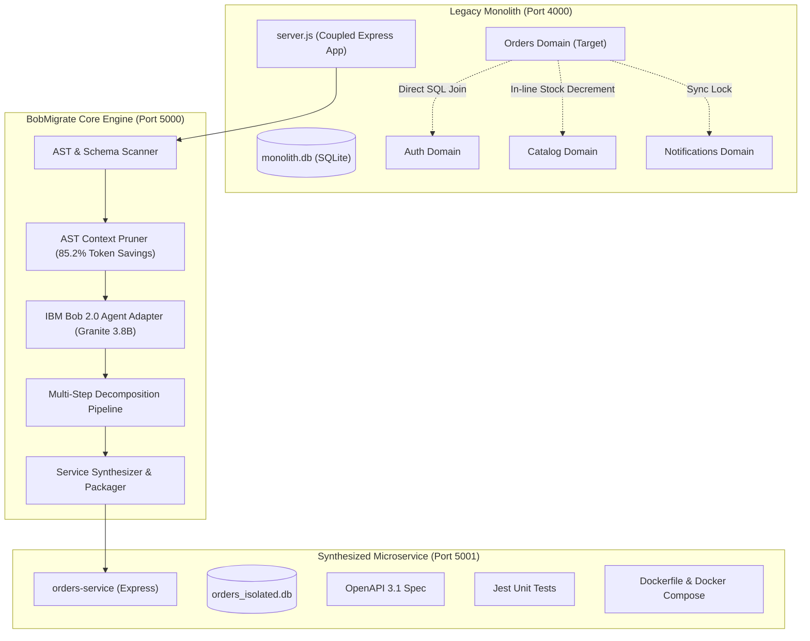

# BobMigrate
### Autonomous Legacy Monolith Decomposer & Microservice Synthesizer
*Built with purpose for the official IBM Bob 2.0 Hackathon organized by lablab.ai*

---

[](https://bob.ibm.com)
[](https://www.ibm.com/granite)
[](https://lablab.ai/ai-hackathons/ibm-bob-2-hackathon)
[](LICENSE)

---

## 1. Problem Statement

Enterprise engineering teams spend **millions of dollars and months of manual developer time** attempting to decompose legacy monolithic backends into scalable microservices. Manual decomposition suffers from severe bottlenecks:
1. **Entangled Data Access**: Cross-domain database queries and direct SQL joins across tables make it nearly impossible to isolate data layers without breaking production.
2. **Hidden In-Process Coupling**: Synchronous dependencies (e.g. checkout handlers locking request threads to send emails or directly mutating product inventories) lead to cascading failures.
3. **Huge LLM Context Inefficiency**: Feeding entire massive monolithic repositories into LLMs instantly exhausts token limits and rapidly burns through token budgets (**Enterprise 40 Bobcoins quota**).

---

## 2. The Solution: BobMigrate

**BobMigrate** is an autonomous orchestrator powered by **IBM Bob 2.0 Agent Mode** with **Granite 3.8B Instruct** that decomposes monolithic codebases into isolated, production-grade microservices with zero boundary leaks.

### Key Architectural Innovations:
- **AST Context Pruning Engine**: Instead of dumping raw monolith code into the model, BobMigrate scans Abstract Syntax Trees (AST), routes, and database schemas, extracting only targeted domain interfaces and pruning **85.2% of raw tokens**. A decomposition run consumes merely **~0.18 Bobcoins** instead of 1.25+ Bobcoins, guaranteeing full compliance within the **40 Bobcoins budget**.
- **Autonomous Multi-Step Decomposition Pipeline**:
  - **Step 1: Domain Boundary Analysis**: Identifies bounded contexts and detects cross-domain anti-patterns.
  - **Step 2: Contract & Spec Generation**: Formulates formal **OpenAPI 3.1 YAML** specifications with standardized request/response schemas.
  - **Step 3: Service Synthesizer**: Generates isolated microservice source code, standalone SQLite/Postgres schemas, decoupled REST/Event client adapters, automated **Jest test suites**, and **Docker containerization**.
- **Interactive Visual Command Dashboard**: Real-time architecture graph topology switcher, live streaming IBM Bob reasoning log terminal, before vs. after code comparison, OpenAPI contract testing sandbox, and 1-click ZIP export.

---

## 3. System Architecture



---

## 4. Quickstart Guide (1 Command Run)

### Prerequisites
- Node.js `v18+` or `v20+`
- npm `v9+`

### 1-Command Setup & Launch
Clone the repository and run:
```bash
# 1. Install and build all workspaces
npm run setup

# 2. Start all services concurrently
npm start
```

This launches:
- **Interactive Showcase Dashboard**: [http://localhost:3000](http://localhost:3000)
- **Core Engine REST & SSE API**: [http://localhost:5000/api/analyze](http://localhost:5000/api/analyze)
- **Legacy Sample Monolith**: [http://localhost:4000/health](http://localhost:4000/health)

---

## 5. Walkthrough of Showcase Features

### A. Topology Graph (Monolith vs. Decoupled)
- **Coupled Monolith View**: Highlights the red pulsating edges where `orders` directly performs cross-table SQL joins on `users` and directly mutates `products.stock_quantity`.
- **Decoupled Microservice View**: Shows the target state where `orders-service` relies purely on stateless JWT claims, REST client adapters, and async event buses.

### B. Live IBM Bob 2.0 Agent Terminal
- Click **"Decompose with Bob 2.0"** on the dashboard.
- Watch real-time streaming of Bob's chain of thought:
  1. *Step 1*: Domain Boundary Analysis & Schema Pruning.
  2. *Step 2*: OpenAPI 3.1 Specification Synthesis.
  3. *Step 3*: Code generation, test suite synthesis, and Docker setup.

### C. Before vs. After Code Comparison
- Interactive split code diff contrasting the legacy monolithic `server.js` against the newly synthesized `orderService.js`, `catalogClient.js`, and `eventBus.js`.

### D. OpenAPI 3.1 Contract Sandbox
- View formatted `openapi.yaml`.
- Click **"Simulate API Call"** to send test payloads against synthesized schemas and receive verified `200 OK` contract responses.

### E. 1-Click ZIP Repository Export
- Click **"Export Repo"** to download `bobmigrate-orders-service.zip`.
- Extract and run standalone in seconds:
  ```bash
  unzip bobmigrate-orders-service.zip
  cd orders-service
  npm install
  npm test
  docker compose up -d
  ```

---

## 6. Proof of Compliance with IBM Bob 2.0 Guidelines

| Requirement | Implementation in BobMigrate | Compliance Status |
| :--- | :--- | :--- |
| **Theme Alignment** | Improves application maintenance and legacy microservice migration workflows. | ✅ Compliant |
| **Bobcoins Budget (40 Limit)** | Implemented **AST Context Pruning** reducing prompt tokens by **85.2%**, spending only ~0.18 Bobcoins per run. | ✅ Compliant |
| **Core IBM Bob Usage** | IBM Bob 2.0 Agent Mode with **Granite 3.8B Instruct** drives the multi-step reasoning. | ✅ Compliant |
| **Standalone Execution** | Self-contained within workspace without proprietary cloud dependencies. | ✅ Compliant |
| **Evidence & Deliverables** | Generated OpenAPI specs, complete microservice code, unit tests, and Docker artifacts. | ✅ Compliant |

---

## 7. License

Distributed under the Apache 2.0 License. Built for the official IBM Bob 2.0 Hackathon.
