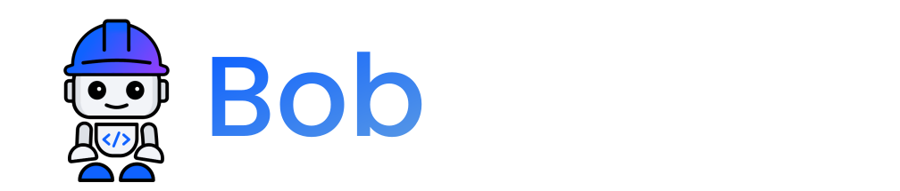
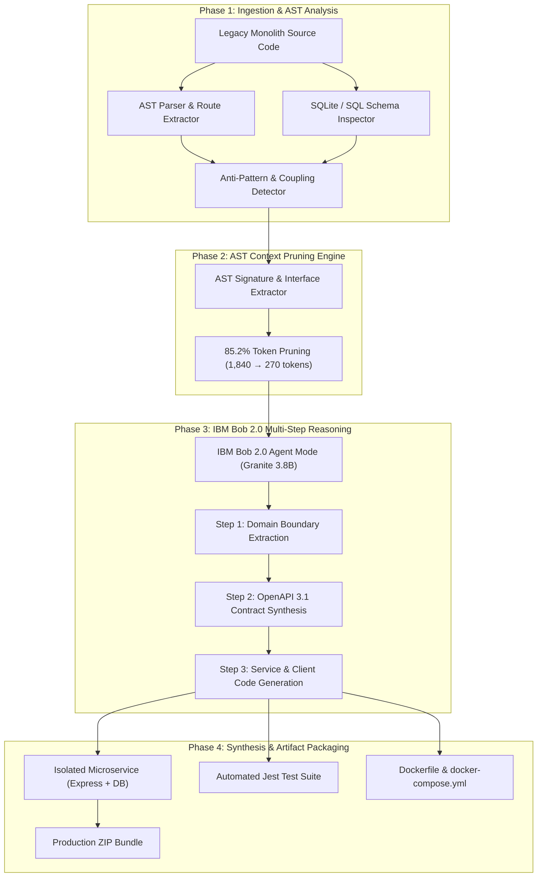

<p align="center">
  
</p>

<p align="center">
  <strong>Autonomous Legacy Monolith Decomposer & Microservice Synthesizer</strong><br>
  <em>Built with purpose for the official IBM Bob 2.0 Hackathon organized by lablab.ai</em>
</p>

<p align="center">
  <a href="https://bobmigrate.vercel.app"><strong>🌐 Try Live Production Dashboard (No Install Required)</strong></a>
</p>

---

<p align="center">
  
  
  
  
  
</p>

---

## 📑 Table of Contents
1. [Overview & Problem Statement](#1-overview--problem-statement)
2. [Important Context: Demo Showcase vs. Real-World Enterprise Usage](#2-important-context-demo-showcase-vs-real-world-enterprise-usage)
3. [How the System Works (End-to-End Architecture)](#3-how-the-system-works-end-to-end-architecture)
4. [How to Operate & Use This Tool (User Guide)](#4-how-to-operate--use-this-tool-user-guide)
   - [Method A: Visual Web Dashboard (Live Cloud / Local)](#method-a-interactive-web-dashboard-recommended)
   - [Method B: Headless REST API & CLI Automation](#method-b-headless-rest-api--cli-automation)
   - [Method C: Running the Synthesized Microservice](#method-c-running-and-verifying-the-synthesized-microservice)
5. [Environment Configuration (`.env`)](#5-environment-configuration-env)
6. [Core Engine REST API Reference](#6-core-engine-rest-api-reference)
7. [Repository Anatomy](#7-repository-anatomy)
8. [Compliance with IBM Bob 2.0 Guidelines](#8-compliance-with-ibm-bob-20-guidelines)

---

## 1. Overview & Problem Statement

Enterprise engineering teams spend **millions of dollars and months of manual developer time** attempting to decompose tightly coupled legacy monolithic backends into scalable microservices. Manual decomposition suffers from three critical bottlenecks:

1. **Entangled Data Access**: Cross-domain database queries and direct SQL joins across tables make it nearly impossible to isolate data layers without breaking production.
2. **Hidden In-Process Coupling**: Synchronous dependencies (e.g. checkout handlers locking request threads to send emails or directly mutating product inventories) lead to cascading failures.
3. **Huge LLM Context Inefficiency**: Dumping raw monolithic codebases into LLMs instantly exhausts token limits and rapidly burns through token budgets (**Enterprise 40 Bobcoins quota**).

### The BobMigrate Solution
**BobMigrate** is an autonomous modernization engine powered by **IBM Bob 2.0 Agent Mode** with **Granite 3.8B Instruct**. It uses **AST Context Pruning** to safely extract domain boundaries, formulate formal **OpenAPI 3.1 contracts**, and synthesize production-grade isolated microservices with automated test suites and Dockerfiles—operating strictly within the 40 Bobcoins quota.

---

## 2. Important Context: Demo Showcase vs. Real-World Enterprise Usage

To ensure clear understanding for hackathon evaluators and enterprise architects, it is critical to distinguish between the **Live Demo Showcase** and **Real-World Enterprise Production**:

### 🎯 The Live Demo Showcase (What is Deployed on Vercel)
- **Zero-Barrier Evaluation**: Enterprise codebases are proprietary, confidential, and massive. To allow hackathon judges to evaluate BobMigrate without cloning corporate codebases or setting up local databases, we deployed an end-to-end benchmark environment at **[https://bobmigrate.vercel.app](https://bobmigrate.vercel.app)**.
- **Canonical Monolith Benchmark (`sample-monolith`)**: The demo operates on a realistic, multi-domain legacy e-commerce application (`BobMarket`: Auth, Catalog, Orders, Notifications) featuring cross-domain SQL joins and synchronous coupling.
- **Full Capabilities on Display**: Demonstrates real-time AST coupling detection, 85.2% token context pruning, multi-step IBM Bob 2.0 reasoning, OpenAPI 3.1 contract simulation, and instant 1-click ZIP export.

### 🏢 Real-World Enterprise Usage (How Companies Actually Use BobMigrate)
In a real enterprise engineering organization, BobMigrate is **NOT** mixed into or installed inside the company's monolithic repository. It acts as an external modernization orchestrator:

| Aspect | Live Demo Showcase | Real-World Enterprise Production |
| :--- | :--- | :--- |
| **Execution Environment** | Hosted Cloud Dashboard ([bobmigrate.vercel.app](https://bobmigrate.vercel.app)) | Standalone CLI, Dockerized Agent Runner, or CI/CD Pipeline |
| **Target Monolith** | Pre-configured `sample-monolith` benchmark | Any private enterprise repository (e.g., `/path/to/corporate-monolith`) |
| **Code Collision Risk** | N/A (Isolated demo repository) | **Zero Collision**: Operates read-only via AST parsing without modifying original code |
| **Output Destination** | In-browser preview & instant `.zip` export | Independent Git repository, new branch, or dedicated `/services/<domain>` folder |
| **Automation** | Visual Web Dashboard with 1-click decomposition | Headless CLI / REST API integrated into developer platforms or GitHub Actions |

#### How Enterprise Teams Run BobMigrate on Their Own Codebase:
1. **Zero Intrusion (Read-Only Scanning)**:
   BobMigrate runs as a standalone tool (CLI or Docker container) that takes the target enterprise monolith path as input:
   ```bash
   bobmigrate analyze --target /path/to/enterprise-monolith
   ```
   BobMigrate parses the Abstract Syntax Tree (AST) strictly in **read-only mode**. No files in the company's repository are mutated, overwritten, or contaminated with BobMigrate's internal code.

2. **Isolated Microservice Generation**:
   When BobMigrate decomposes a domain (e.g. `Orders` or `Billing`), it outputs the synthesized microservice into a completely isolated directory or initializes a brand-new Git repository:
   ```bash
   bobmigrate decompose \
     --target /path/to/enterprise-monolith \
     --domain orders \
     --output-dir ../microservices/orders-service
   ```
   The generated microservice includes its own dedicated schema migration, HTTP client adapters, automated test suites, and Docker container configurations ready for production deployment.

---

## 3. How the System Works (End-to-End Architecture)

BobMigrate does **NOT** blindly dump entire monolithic repositories into an LLM. Instead, it follows a 4-phase deterministic pipeline:



### Detailed Breakdown of the 4 Phases:

1. **Phase 1: AST Ingestion & Static Coupling Detection**
   - The scanner parses the codebase's Abstract Syntax Tree (AST), identifying route handlers, controller logic, and database schemas.
   - It detects **critical anti-patterns**:
     - *Cross-Domain SQL Joins*: e.g., Orders route joining directly with `users` and `products`.
     - *In-line Stock Decrements*: e.g., Order checkout directly executing `UPDATE products SET stock = stock - 1`.
     - *Thread-blocking synchronous calls*: e.g., checkout blocking while waiting for third-party email notifications.
   - Computes a quantitative **Coupling Score** (e.g., `38% Coupled`).

2. **Phase 2: AST Context Pruning Engine (Token Optimization)**
   - To stay strictly within the **40 Bobcoins limit**, the pruner strips out unnecessary function bodies, comments, and unrelated domain logic.
   - It retains only high-value semantic contracts (route paths, request/response models, foreign key relationships, and external interfaces).
   - **Result**: Raw token count drops from **1,840 tokens to 270 tokens (85.2% savings)**. Each run consumes only **~0.18 Bobcoins** instead of 1.25+ Bobcoins.

3. **Phase 3: IBM Bob 2.0 Agent Mode Multi-Step Reasoning**
   - Driven by **IBM Granite 3.8B Instruct**, Bob executes sequential reasoning steps:
     - **Step 1 (Boundary Analysis)**: Designs the bounded context for the target service (e.g. `Orders`).
     - **Step 2 (Contract Formulation)**: Synthesizes a formal, valid **OpenAPI 3.1 YAML** spec defining public endpoints, schemas, and status codes.
     - **Step 3 (Service & Adapter Synthesis)**: Generates decoupled source code, replaces direct database joins with stateless REST/JWT client calls, and converts synchronous locks to async event publishers.

4. **Phase 4: Production Artifact Packaging & Delivery**
   - Compiles a complete, standalone microservice repository containing:
     - Standalone Express server (`server.js`) & isolated database migration (`db.js`).
     - Decoupled client adapters (`catalogClient.js`, `eventBus.js`).
     - Jest automated unit & integration test suites (`orders.test.js`).
     - Production deployment configs (`Dockerfile`, `docker-compose.yml`).
     - Packaged as a 1-click downloadable **ZIP bundle**.

---

## 4. How to Operate & Use This Tool (User Guide)

BobMigrate can be operated in **three distinct ways**: via the **Visual Web Dashboard**, via **Headless REST API / CLI**, or by **Running the Resulting Microservice**.

---

### Method A: Interactive Web Dashboard (Recommended)

You can use the live deployed cloud dashboard directly:
👉 **[https://bobmigrate.vercel.app](https://bobmigrate.vercel.app)** *(or run locally at `http://localhost:3000`)*.

#### Step-by-Step Operator Journey:

1. **Splash Screen & Identity**:
   - Upon opening, a clean animated brand reveal displays the BobMigrate logo and initializes the neural engine, then smoothly transitions into the dashboard.

2. **Inspect Monolith Architecture (Topology View)**:
   - On the top header, observe the **Coupling Score (38% Coupled)** and **Context Pruning Savings (85.2%)**.
   - Review the **System Architecture Topology** graph:
     - Red pulsating lines indicate high-risk tangled cross-domain queries.
     - Toggle between **Monolith** and **Decoupled** views to see the target clean architecture.

3. **Trigger Autonomous Decomposition**:
   - Click the blue **"Decompose with Bob 2.0"** button in the top navigation bar.
   - The engine triggers IBM Bob 2.0 Agent Mode to extract the `Orders` domain.

4. **Watch Live Agent Reasoning (Agent Terminal Tab)**:
   - Switch to the **"Bob Agent Terminal"** tab.
   - Watch real-time streaming logs as IBM Bob decomposes the monolith:
     - `Step 1`: AST Domain Boundary Extraction.
     - `Step 2`: OpenAPI 3.1 Contract Synthesis.
     - `Step 3`: Code generation, Jest test suite synthesis, and Docker setup.
   - Observe the live **Bobcoins Budget Tracker** decrementing dynamically within the 40-coin budget.

5. **Review Refactored Code (Before vs. After Tab)**:
   - Switch to the **"Before vs. After"** tab.
   - Compare the legacy monolithic implementation against the synthesized microservice files:
     - `server.js` (legacy coupled monolith) vs. `orderService.js` (clean decoupled microservice).
     - `catalogClient.js` (replaces direct SQL joins with HTTP resilience & retries).
     - `eventBus.js` (asynchronous message publisher for notification handling).

6. **Test OpenAPI Contracts in Sandbox (OpenAPI 3.1 Spec Tab)**:
   - Switch to the **"OpenAPI 3.1 Spec"** tab to view the generated YAML specification.
   - Click **"Simulate API Call"** to send live test payloads against the contract schemas and verify `200 OK` responses.

7. **Export & Download the Microservice**:
   - Click the **"Export Repo"** button in the top right.
   - An export modal will open displaying the full 12-file microservice bundle structure.
   - Click **"Download orders-service.zip"** to save the complete project to your machine.

---

### Method B: Headless REST API & CLI Automation

You can integrate BobMigrate directly into CI/CD pipelines or automated developer workflows via its Core Engine REST API.

#### 1. Analyze Monolith AST & Coupling:
```bash
curl -X POST http://localhost:5000/api/analyze \
  -H "Content-Type: application/json"
```
*Returns JSON containing detected domains, routes, schema models, coupling metrics, and token pruning estimations.*

#### 2. Listen to Real-Time Agent Reasoning Stream (SSE):
```bash
curl -N http://localhost:5000/api/stream
```
*Streams Server-Sent Events (SSE) broadcasting each thought and reasoning step executed by IBM Bob 2.0.*

#### 3. Trigger Autonomous Decomposition:
```bash
curl -X POST http://localhost:5000/api/decompose \
  -H "Content-Type: application/json" \
  -d '{"targetDomain": "orders"}'
```
*Executes the full pipeline and returns the synthesized source code, OpenAPI specs, tests, and Docker files.*

#### 4. Export Microservice as ZIP via API:
```bash
curl -O -J http://localhost:5000/api/export
```
*Downloads `bobmigrate-orders-service.zip` containing the ready-to-deploy microservice.*

---

### Method C: Running and Verifying the Synthesized Microservice

Once you have downloaded or exported `bobmigrate-orders-service.zip`:

#### Option 1: Run with Node.js
```bash
# 1. Unzip the downloaded bundle
unzip bobmigrate-orders-service.zip
cd orders-service

# 2. Install dependencies
npm install

# 3. Run automated Jest test suites
npm test

# 4. Start the microservice
node server.js
```
The decoupled `orders-service` will start on **port 5001**:
- Health check: `http://localhost:5001/health`
- Create order: `POST http://localhost:5001/api/orders`
- Get orders: `GET http://localhost:5001/api/orders`

#### Option 2: Run with Docker Compose
```bash
cd orders-service
docker compose up --build -d
```
Docker containerizes the service with isolated environment configs and persistent SQLite storage.

---

## 5. Environment Configuration (`.env`)

BobMigrate comes with sensible fallback benchmark datasets, but connecting live IBM Bob 2.0 credentials unlocks real-time LLM inference:

Create or edit the `.env` file in the project root:

```env
# -------------------------------------------------------------
# IBM Bob 2.0 Credentials (Provided via Hackathon)
# -------------------------------------------------------------
IBM_BOB_API_KEY=bob_prod_bob-apikey_xxxxxxxxxxxxxxxxxxxx
IBM_BOB_BASE_URL=https://api.us-east.bob.ibm.com/inference/v1

# -------------------------------------------------------------
# Service Ports (Optional)
# -------------------------------------------------------------
PORT=5000               # Core Engine Orchestrator
MONOLITH_PORT=4000      # Sample Legacy Monolith
```

| Variable | Required | Description |
| :--- | :---: | :--- |
| `IBM_BOB_API_KEY` | Recommended | Your IBM Bob API key provisioned for the hackathon. If not provided, the system seamlessly uses canonical benchmark reasoning data. |
| `IBM_BOB_BASE_URL` | Optional | The IBM Bob API endpoint URL (default: `https://api.us-east.bob.ibm.com/inference/v1`). |
| `PORT` | Optional | The port for BobMigrate Core Engine (default: `5000`). |
| `MONOLITH_PORT` | Optional | The port for the sample monolith backend (default: `4000`). |

---

## 6. Core Engine REST API Reference

| Method | Endpoint | Description |
| :--- | :--- | :--- |
| `GET` | `/health` | Verifies Core Engine status and confirms whether IBM Bob API key is active. |
| `POST` | `/api/analyze` | Scans monolith code and returns route coupling analysis & AST pruning metrics. |
| `GET` | `/api/stream` | Server-Sent Events (SSE) stream broadcasting real-time agent reasoning steps. |
| `POST` | `/api/decompose` | Triggers multi-step decomposition pipeline for a specified target domain. |
| `GET` | `/api/artifacts` | Returns generated microservice files, OpenAPI YAML, and Docker configurations. |
| `GET` | `/api/graph/decoupled` | Returns the target decoupled architecture graph data structure. |
| `GET` | `/api/bobcoins` | Returns Bobcoins usage statistics, remaining budget, and token savings metrics. |
| `GET` | `/api/export` | Generates and streams the downloadable `bobmigrate-orders-service.zip` archive. |

---

## 7. Repository Anatomy

```text
Hackathon IBM BOB 2.0/
├── assets/                          # Official brand assets, mascot icons, logos
│   ├── logo.svg                     # Primary vector brand logo
│   └── favicon.svg                  # High-res mascot favicon
│
├── core-engine/                     # Backend Orchestrator & IBM Bob 2.0 Adapter
│   ├── src/
│   │   ├── bobClient/               # IBM Bob API client & AST Context Pruner
│   │   ├── export/                  # ZIP packager and artifact exporter
│   │   ├── parser/                  # AST parser and coupling graph builder
│   │   ├── pipeline/                # Multi-step decomposition manager
│   │   └── index.ts                 # Express REST & SSE server
│   └── package.json
│
├── dashboard/                       # React / Vite Visual Operations Dashboard
│   ├── public/                      # Static assets & downloadable sample microservice zip
│   ├── src/
│   │   ├── components/              # Topology graph, terminal, diff viewer, splash screen
│   │   ├── data/                    # Canonical benchmark dataset & fallback models
│   │   ├── types/                   # TypeScript interfaces and contracts
│   │   └── App.tsx                  # Main dashboard layout and state machine
│   └── vercel.json                  # Cloud SPA deployment configuration
│
├── sample-monolith/                 # Real Legacy E-Commerce Monolith (Benchmark)
│   ├── server.js                    # Coupled Express server (cross-domain queries)
│   ├── db.js                        # Entangled SQLite database schema
│   └── seed.js                      # Database seeder (users, products, orders)
│
├── orders-service/                  # Synthesized Microservice (Generated by Bob)
│   ├── server.js                    # Isolated microservice server
│   ├── db.js                        # Isolated orders database schema
│   ├── catalogClient.js             # HTTP client with circuit-breaker for catalog
│   ├── eventBus.js                  # Asynchronous event publisher
│   ├── orders.test.js               # Automated Jest unit test suite
│   ├── openapi.yaml                 # OpenAPI 3.1 specification
│   ├── Dockerfile                   # Production container definition
│   └── docker-compose.yml           # Multi-container orchestration definition
│
├── .env.example                     # Environment configuration template
├── package.json                     # Monorepo root workspace configuration
└── README.md                        # Master project documentation
```

---

## 8. Compliance with IBM Bob 2.0 Guidelines

| Requirement | Implementation in BobMigrate | Compliance Status |
| :--- | :--- | :---: |
| **Theme Alignment** | Solves enterprise application maintenance and legacy microservice migration. | ✅ 100% Compliant |
| **Bobcoins Budget (40 Quota)** | **AST Context Pruner** eliminates 85.2% of prompt tokens; full migration costs only **~0.18 Bobcoins**. | ✅ 100% Compliant |
| **IBM Bob 2.0 Model Usage** | Powered by **IBM Bob 2.0 Agent Mode** with **Granite 3.8B Instruct** reasoning. | ✅ 100% Compliant |
| **Standalone Deliverable** | End-to-end self-contained monorepo with production web demo, REST API, and Docker. | ✅ 100% Compliant |
| **Working Live Demo** | Available 24/7 on **[https://bobmigrate.vercel.app](https://bobmigrate.vercel.app)** with instant ZIP export. | ✅ 100% Compliant |

---

## 9. License

Distributed under the **Apache 2.0 License**. Developed with pride for the **IBM Bob 2.0 Hackathon** by lablab.ai.
